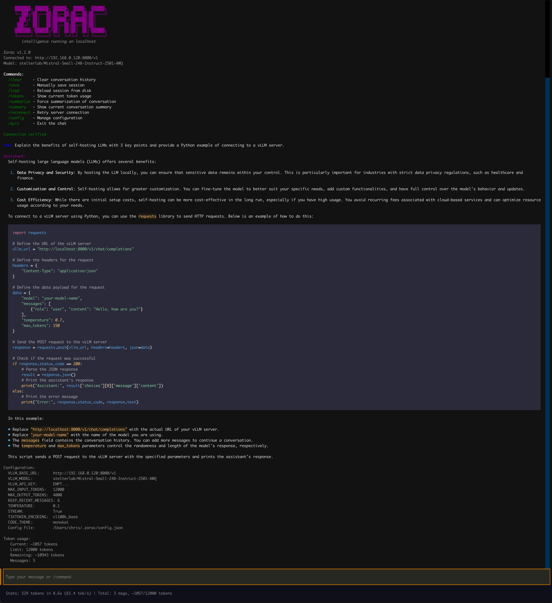
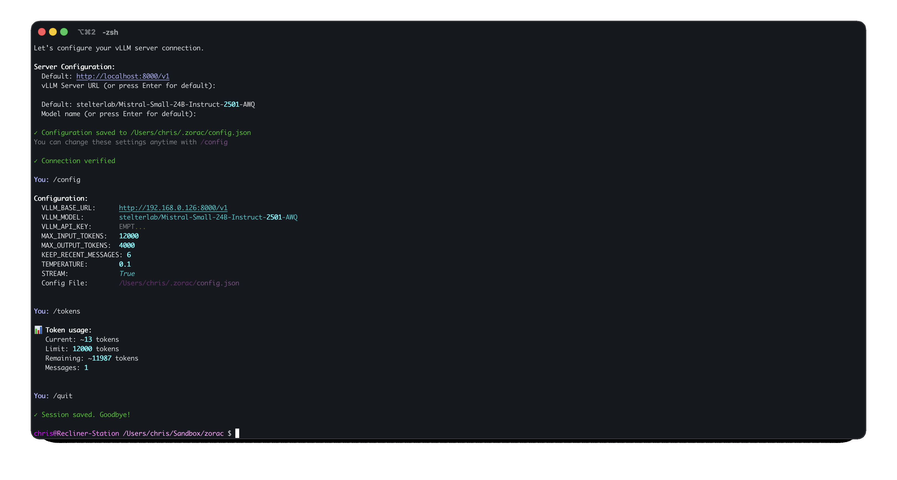

# Zorac - Self-Hosted Local LLM Chat Client


A fun terminal chat client for running **local LLMs on consumer hardware**. Chat with powerful AI models like Mistral-24B privately on your own RTX 4090/3090 - no cloud, no costs, complete privacy.

Perfect for developers who want a **self-hosted ChatGPT alternative** running on their gaming PC or homelab server. Also good for local AI coding assistants, agentic workflows and agent development.

> Named after ZORAC, the intelligent Ganymean computer from James P. Hogan's *The Gentle Giants of Ganymede*.

## Why Self-Host Your LLM?

- **Zero ongoing costs** - No API fees, run unlimited queries
- **Complete privacy** - Your data never leaves your machine
- **Low latency** - Sub-second responses on local hardware
- **Use existing hardware** - Your gaming GPU works great for AI
- **Full control** - Customize models, parameters, and behavior
- **Work offline** - No internet required after initial setup

## Features

- **Interactive CLI** - Natural conversation flow with continuous input prompts
- **Rich Terminal UI** - Beautiful formatted output with colors, panels, and markdown rendering
- **Streaming Responses** - Real-time token streaming with live markdown display
- **Persistent Sessions** - Automatically saves and restores conversation history
- **Smart Context Management** - Automatically summarizes old messages when approaching token limits
- **Token Tracking** - Real-time monitoring of token usage with tiktoken
- **Performance Metrics** - Displays tokens/second, response time, and resource usage
- **Configurable** - Adjust all parameters via `.env`, config file, or runtime commands

## Demo

### Rich Terminal UI with Live Streaming

*Interactive chat with real-time streaming responses, markdown rendering, and performance metrics*



### Token Management & Commands

*Built-in commands for session management and token tracking*



## Quick Start

### 1. Download Binary (Easiest)

Download from the [latest release](https://github.com/chris-colinsky/Zorac/releases/latest) - no Python required!

```bash
# Linux
wget https://github.com/chris-colinsky/Zorac/releases/latest/download/zorac-linux-x86_64
chmod +x zorac-linux-x86_64
./zorac-linux-x86_64

# macOS
wget https://github.com/chris-colinsky/Zorac/releases/latest/download/zorac-macos-arm64
chmod +x zorac-macos-arm64
./zorac-macos-arm64
```

**macOS Security Note:** Since this binary is unsigned, macOS will block it on first run. To allow it:
1. Try to run the binary (it will be blocked)
2. Open **System Settings** → **Privacy & Security**
3. Scroll down to the **Security** section
4. Click **"Open Anyway"** next to the Zorac message
5. Run the binary again and click **"Open"** when prompted

See [Apple's guide on opening apps from unidentified developers](https://support.apple.com/en-us/102445) for more details.

**Windows Users:** Use [WSL (Windows Subsystem for Linux)](https://learn.microsoft.com/en-us/windows/wsl/install) and follow the Linux instructions above.

### 2. Set Up vLLM Server

You need a vLLM inference server running. See [SERVER_SETUP.md](docs/SERVER_SETUP.md) for complete setup instructions.

Quick server start (if already set up):

```bash
vllm serve stelterlab/Mistral-Small-24B-Instruct-2501-AWQ \
  --quantization awq_marlin \
  --dtype half \
  --max-model-len 16384 \
  --max-num-seqs 32
```

### 3. Configure & Run

**First Run:**

When you start Zorac for the first time, you'll be greeted with a setup wizard:

```bash
$ zorac

     ███████╗ ██████╗ ██████╗  █████╗  ██████╗
     ╚══███╔╝██╔═══██╗██╔══██╗██╔══██╗██╔════╝
       ███╔╝ ██║   ██║██████╔╝███████║██║
      ███╔╝  ██║   ██║██╔══██╗██╔══██║██║
     ███████╗╚██████╔╝██║  ██║██║  ██║╚██████╗
     ╚══════╝ ╚═════╝ ╚═╝  ╚═╝╚═╝  ╚═╝ ╚═════╝
        intelligence running on localhost

────────────────────── Welcome to Zorac! ──────────────────────

This appears to be your first time running Zorac.
Let's configure your vLLM server connection.

Server Configuration:
  Default: http://localhost:8000/v1
  vLLM Server URL (or press Enter for default):

  Default: stelterlab/Mistral-Small-24B-Instruct-2501-AWQ
  Model name (or press Enter for default):

✓ Configuration saved to ~/.zorac/config.json
You can change these settings anytime with /config
```

**Viewing Configuration:**

After setup, you can view or modify your configuration anytime:

```bash
# View all settings
You: /config list

Configuration:
  VLLM_BASE_URL:      http://localhost:8000/v1
  VLLM_MODEL:         stelterlab/Mistral-Small-24B-Instruct-2501-AWQ
  MAX_INPUT_TOKENS:   12000
  MAX_OUTPUT_TOKENS:  4000
  TEMPERATURE:        0.1

# Update a setting
You: /config set VLLM_BASE_URL http://YOUR_SERVER:8000/v1
✓ Updated VLLM_BASE_URL in ~/.zorac/config.json

# See all available commands
You: /help
```

**Alternative (Source Users):**

If running from source, you can also create a `.env` file:

```bash
VLLM_BASE_URL=http://localhost:8000/v1
VLLM_MODEL=stelterlab/Mistral-Small-24B-Instruct-2501-AWQ
```

## Documentation

### User Guides

- **[Installation Guide](docs/INSTALLATION.md)** - All installation methods (binary, source, development)
- **[Configuration Guide](docs/CONFIGURATION.md)** - Server setup, token limits, model parameters
- **[Usage Guide](docs/USAGE.md)** - Commands, session management, tips & tricks

### Technical Documentation

- **[Development Guide](docs/DEVELOPMENT.md)** - Contributing, testing, building binaries
- **[Server Setup](docs/SERVER_SETUP.md)** - Complete vLLM server installation and optimization
- **[Claude.md](CLAUDE.md)** - AI assistant development guide
- **[Changelog](CHANGELOG.md)** - Version history and release notes
- **[Contributing](CONTRIBUTING.md)** - Contribution guidelines

## Supported Hardware

This works on **consumer gaming GPUs**:

| GPU | VRAM | Model Size | Performance |
|-----|------|------------|-------------|
| RTX 4090 | 24GB | Up to 24B (AWQ) | 60-65 tok/s ⭐ |
| RTX 3090 Ti | 24GB | Up to 24B (AWQ) | 55-60 tok/s |
| RTX 3090 | 24GB | Up to 24B (AWQ) | 55-60 tok/s |
| RTX 4080 | 16GB | Up to 14B (AWQ) | 45-50 tok/s |
| RTX 4070 Ti | 12GB | Up to 7B (AWQ) | 40-45 tok/s |
| RTX 3080 | 10GB | Up to 7B (AWQ) | 35-40 tok/s |

Recommended configuration. See [SERVER_SETUP.md](docs/SERVER_SETUP.md) for optimization details.

## Use Cases

- **Local ChatGPT alternative** - Private conversations, no data collection
- **Coding assistant** - Works with Continue.dev, Cline, and other AI coding tools
- **Agentic workflows** - LangChain/LangGraph running entirely local
- **Content generation** - Write, summarize, analyze - all offline
- **AI experimentation** - Test prompts and models without API costs
- **Learning AI/ML** - Understand LLM inference without cloud dependencies

## Why Mistral-Small-24B-AWQ?

This application is optimized for `Mistral-Small-24B-Instruct-2501-AWQ`:

- **Superior Intelligence** - 24B parameters offers significantly better reasoning than 7B/8B models
- **Consumer Hardware Ready** - 4-bit AWQ quantization fits in 24GB VRAM
- **High Performance** - AWQ with Marlin kernel enables 60-65 tok/s on RTX 4090

You can use any vLLM-compatible model by changing the `VLLM_MODEL` setting.

## FAQ

<details>
<summary><b>Can I run this without a GPU?</b></summary>

No, this requires an NVIDIA GPU with at least 10GB VRAM. CPU-only inference is too slow for interactive chat (would take minutes per response).
</details>

<details>
<summary><b>How does this compare to running Ollama?</b></summary>

Zorac uses vLLM for faster inference (60+ tok/s vs Ollama's 20-30 tok/s on the same hardware) and supports more advanced features like tool calling for agentic workflows. Ollama is easier to set up but slower for production use.
</details>

<details>
<summary><b>Do I need to be online?</b></summary>

Only for the initial model download (~14GB for Mistral-24B-AWQ). After that, everything runs completely offline on your local machine.
</details>

<details>
<summary><b>Is this legal? Can I use this commercially?</b></summary>

Yes! Mistral-Small is Apache 2.0 licensed, which allows free commercial use. vLLM is also open source (Apache 2.0). No restrictions.
</details>

<details>
<summary><b>What about AMD GPUs or Mac M-series chips?</b></summary>

This guide is specifically for NVIDIA GPUs using CUDA. For AMD GPUs, you'd need ROCm support (experimental). For Mac M-series, check out MLX or llama.cpp instead.
</details>

<details>
<summary><b>How much does it cost to run?</b></summary>

Electricity cost for an RTX 4090 running at ~300W is roughly $0.05-0.10 per hour (depending on your electricity rates). Far cheaper than API costs for heavy usage.
</details>

<details>
<summary><b>What other models can I run?</b></summary>

Any model with vLLM support: Llama, Qwen, Phi, DeepSeek, etc. Just change the `VLLM_MODEL` setting. Check [vLLM's supported models](https://docs.vllm.ai/en/latest/models/supported_models.html).
</details>

## Requirements

- **For Binary Users:** Nothing! Just download and run.
- **For Source Users:** Python 3.13+, `uv` package manager
- **For Server:** NVIDIA GPU with 10GB+ VRAM, vLLM inference server

## License

MIT License - see [LICENSE](LICENSE) for details.

## Contributing

Contributions are welcome! See [CONTRIBUTING.md](CONTRIBUTING.md) for guidelines.

## Support

- 📖 Read the [Documentation](docs/)
- 🐛 Report bugs via [GitHub Issues](https://github.com/chris-colinsky/Zorac/issues)
- 💡 Request features via [GitHub Issues](https://github.com/chris-colinsky/Zorac/issues)
- 📚 Check [vLLM Documentation](https://docs.vllm.ai/) for server issues

---

**Star this repo if you find it useful! ⭐**
