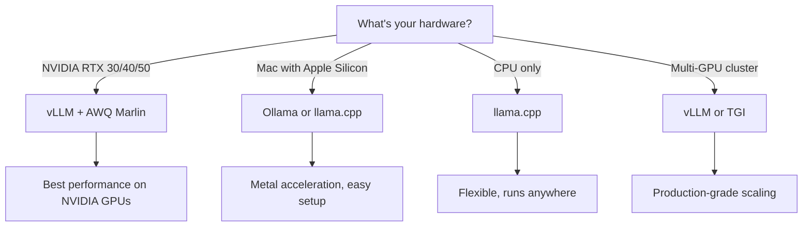

# Inference Servers

What inference servers do, why you need one between your application and the model, and how vLLM compares to alternatives like Ollama, TGI, and llama.cpp.

---

## Why Not Load the Model Directly?

You might wonder: why not just load the model in Python and call it directly? In theory, you could — libraries like Hugging Face Transformers let you do exactly that. But for production use (even a local "production" like Zorac), a dedicated inference server provides critical capabilities that raw model loading doesn't.

### Memory Management

A 24B model at 4-bit quantization uses ~14GB of VRAM. Loading it into a Python script means that memory is locked for the lifetime of the process. An inference server manages GPU memory intelligently:

- **Model loading once** — The server loads the model at startup and keeps it resident. Multiple clients can share the same loaded model without each loading their own copy.
- **KV cache management** — The server allocates and manages the KV cache (conversation context memory) efficiently, recycling memory from completed requests.
- **Memory budgeting** — Servers like vLLM let you control exactly how much VRAM to use (`--gpu-memory-utilization`), preventing out-of-memory crashes.

### Batching and Concurrency

When multiple requests arrive at the same time, a naive approach would process them sequentially — each request waiting for the previous one to finish. Inference servers solve this with **batching**:

- **Continuous batching** (vLLM) — New requests are added to the running batch dynamically, without waiting for all current requests to finish. This dramatically improves throughput for concurrent users.
- **Request queuing** — When the server is at capacity, new requests queue gracefully rather than crashing.

Even if you're the only user (common for self-hosted setups), batching still helps — some applications (like LangChain agents) may issue multiple concurrent requests.

### The OpenAI-Compatible API

Most inference servers expose an **OpenAI-compatible REST API**. This is a standardized interface that mimics the OpenAI API endpoints (`/v1/chat/completions`, `/v1/models`, etc.), which means:

- **Client library reuse** — You can use the official OpenAI Python client to talk to your local server. Zorac uses `AsyncOpenAI` pointed at `http://localhost:8000/v1` instead of `https://api.openai.com/v1`.
- **Drop-in replacement** — Code written for OpenAI's cloud API works with local models by changing one URL.
- **Tool/function calling** — The API standard includes tool calling support, enabling agentic workflows.

This is how Zorac connects to vLLM:

```python
from openai import AsyncOpenAI

client = AsyncOpenAI(
    base_url="http://localhost:8000/v1",  # Local vLLM server
    api_key="EMPTY",                       # vLLM doesn't require auth
)
```

---

## vLLM

[vLLM](https://docs.vllm.ai/) is a high-throughput inference engine built for production LLM serving. It's what Zorac recommends and defaults to.

### Architecture Overview

vLLM runs as a standalone HTTP server that:

1. Loads a model from Hugging Face Hub (or a local path) into GPU memory at startup
2. Exposes OpenAI-compatible API endpoints
3. Manages the KV cache, request scheduling, and GPU memory automatically
4. Supports streaming responses via Server-Sent Events (SSE)

A typical startup command:

```bash
vllm serve "stelterlab/Mistral-Small-24B-Instruct-2501-AWQ" \
    --quantization awq_marlin \
    --max-model-len 16384 \
    --gpu-memory-utilization 0.85 \
    --host 0.0.0.0 \
    --port 8000
```

### PagedAttention and Memory Efficiency

vLLM's headline feature is **PagedAttention** — a memory management technique inspired by how operating systems handle virtual memory.

Traditional inference servers allocate a contiguous block of memory for each request's KV cache. If a request uses 2k tokens out of a 16k maximum, the remaining 14k tokens of memory sit wasted (reserved but unused). With many concurrent requests, this wasted memory adds up fast.

PagedAttention divides the KV cache into small **pages** (blocks). Pages are allocated on demand as the conversation grows and freed when no longer needed. This eliminates memory waste and allows vLLM to serve significantly more concurrent requests from the same VRAM.

For a single-user setup like Zorac, PagedAttention means the server can allocate the full context window (16k tokens) without reserving all the memory upfront — leaving more VRAM available for the model itself.

### Continuous Batching

Traditional batching waits until a batch of requests is collected, processes them all, then waits for the next batch. This introduces latency for individual requests.

vLLM uses **continuous batching** (also called iteration-level scheduling): new requests can be added to the running batch at every token generation step. When a request finishes generating, its slot is immediately available for a new request.

The result: low latency for individual requests **and** high throughput for concurrent requests — the best of both worlds.

### Supported Quantization Backends

vLLM supports multiple quantization formats:

| Backend | Flag | Speed (RTX 4090) | Notes |
|---------|------|-------------------|-------|
| AWQ + Marlin | `--quantization awq_marlin` | 60-65 tok/s | Recommended for RTX 30/40-series |
| AWQ (generic) | `--quantization awq` | ~6 tok/s | Much slower, avoid on modern GPUs |
| GPTQ | `--quantization gptq` | 45-55 tok/s | Good alternative when AWQ unavailable |
| GGUF | (auto-detected) | ~6 tok/s | Not optimized for vLLM, use llama.cpp instead |

!!! warning "The Marlin Difference"
    The difference between `awq` and `awq_marlin` is dramatic — 10x speed. Always use `awq_marlin` on NVIDIA RTX 30/40-series GPUs. See the [Why AWQ](../decisions/why-awq.md) decision record for the full analysis.

---

## Alternatives Compared

### Ollama

[Ollama](https://ollama.ai/) is the most user-friendly option for running local LLMs. It wraps llama.cpp in a simple CLI with model management (`ollama pull`, `ollama run`).

**Strengths:**

- One-command installation on macOS, Linux, and Windows
- Built-in model library — no hunting for model files
- Excellent for Mac with Apple Silicon (Metal acceleration)
- Simple API compatible with many tools

**Limitations:**

- Built on llama.cpp, so GPU performance on NVIDIA is significantly lower than vLLM
- Less control over memory management and quantization backends
- No continuous batching — concurrent requests are queued sequentially
- Limited tool calling support compared to vLLM

**Best for:** Beginners, Mac users, quick experimentation.

### Text Generation Inference (TGI)

[TGI](https://huggingface.co/docs/text-generation-inference/) is Hugging Face's production inference server. It's battle-tested at scale and deeply integrated with the Hugging Face ecosystem.

**Strengths:**

- Production-proven at large scale
- Good quantization support (GPTQ, AWQ, bitsandbytes)
- Integrated with Hugging Face Hub for model management
- OpenAI-compatible API

**Limitations:**

- Docker-focused deployment (adds complexity for homelab setups)
- vLLM generally achieves higher throughput on consumer GPUs
- Heavier resource footprint than vLLM for single-GPU setups

**Best for:** Hugging Face-centric workflows, Docker-based deployments.

### llama.cpp / llama-cpp-python

[llama.cpp](https://github.com/ggerganov/llama.cpp) is a high-performance C/C++ inference engine that runs on CPUs, Apple Silicon, and GPUs via GGUF models.

**Strengths:**

- Runs on nearly any hardware (CPU, Apple Metal, CUDA, Vulkan)
- Excellent CPU performance
- Flexible quantization (Q2 through Q8)
- Can split models across CPU RAM and GPU VRAM

**Limitations:**

- NVIDIA GPU performance much lower than vLLM with AWQ Marlin
- More complex configuration for GPU offloading
- GGUF model format required (not all models are available)
- Server mode is less polished than vLLM's API

**Best for:** CPU inference, Apple Silicon, systems without NVIDIA GPUs, edge deployment.

### When to Choose Each



For Zorac's use case — interactive chat on an NVIDIA RTX 4090 — vLLM with AWQ Marlin is the clear choice. It delivers the highest performance on consumer NVIDIA hardware and provides the full-featured OpenAI-compatible API that Zorac needs.

---

## vLLM Configuration for Zorac

### Key Flags Explained

Here are the most important vLLM flags for a Zorac deployment:

```bash
vllm serve "stelterlab/Mistral-Small-24B-Instruct-2501-AWQ" \
    --quantization awq_marlin \       # 10x faster than generic AWQ
    --max-model-len 16384 \           # 16k context window
    --gpu-memory-utilization 0.85 \   # Leave 15% VRAM headroom
    --max-num-seqs 32 \               # Prevent OOM from pre-allocation
    --host 0.0.0.0 \                  # Listen on all interfaces
    --port 8000                       # Default port
```

| Flag | Purpose | Zorac Default |
|------|---------|---------------|
| `--quantization` | Quantization backend | `awq_marlin` |
| `--max-model-len` | Maximum context length in tokens | `16384` |
| `--gpu-memory-utilization` | Fraction of VRAM to use | `0.85` |
| `--max-num-seqs` | Max concurrent request slots | `32` |
| `--host` | Network interface to bind | `0.0.0.0` |
| `--port` | HTTP port | `8000` |

### Performance Tuning

**GPU memory utilization:** The `--gpu-memory-utilization` flag controls what fraction of VRAM vLLM can use. On a dedicated inference server, `0.90` is safe. If you're also running a desktop environment, `0.85` prevents display driver conflicts. Setting this to `0.95` often causes initialization crashes.

**Max model length:** Longer context windows use more VRAM for the KV cache. For Mistral-Small-24B on RTX 4090:

- `16384` — Comfortable fit with room for the model + KV cache
- `32768` — Possible but risks OOM under load
- `8192` — Leaves maximum VRAM for concurrent requests

**Max num seqs:** vLLM's V1 engine pre-allocates memory for concurrent request slots. The default (256) can cause OOM on 24GB cards. Setting this to `32` is sufficient for personal use and prevents startup crashes.

### Monitoring and Debugging

Check that vLLM is running and responding:

```bash
# Health check — list available models
curl http://localhost:8000/v1/models

# Test a completion
curl http://localhost:8000/v1/chat/completions \
  -H "Content-Type: application/json" \
  -d '{"model": "stelterlab/Mistral-Small-24B-Instruct-2501-AWQ",
       "messages": [{"role": "user", "content": "Hello!"}]}'

# Monitor GPU usage
nvidia-smi -l 1  # Updates every second
```

If vLLM is running as a systemd service, check its logs:

```bash
sudo journalctl -u vllm -f -o cat
```

For more detailed setup instructions, see the [Server Setup Guide](../guides/server-setup.md) or the [Server Setup Reference](../../SERVER_SETUP.md).
