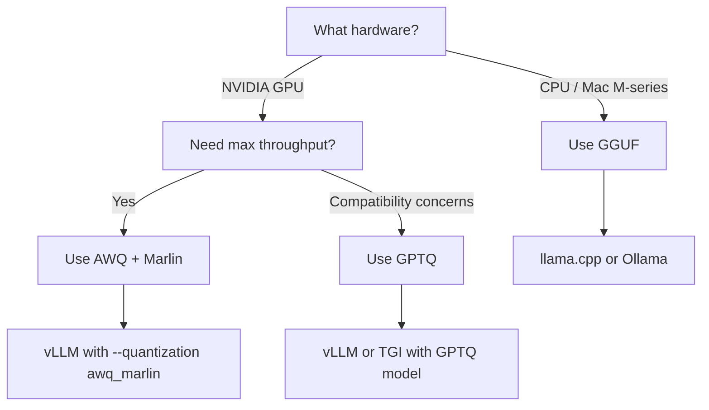

# Quantization: Running Large Models on Consumer GPUs

Quantization is the technique that makes it possible to run a 24-billion parameter model on a single RTX 4090. Without it, Mistral-Small-24B would need ~48GB of VRAM — double what even the highest-end consumer GPU provides.

This page explains what quantization is, compares the major formats, and explains why Zorac defaults to AWQ with Marlin kernels.

---

## Why Quantization Matters

A neural network's "parameters" are just numbers — weights that define what the model has learned. In their original training format, these weights are stored as **16-bit floating point** (FP16/BF16) values. Each parameter takes 2 bytes of memory.

For a 24B parameter model:

```
24,000,000,000 parameters x 2 bytes = 48 GB
```

An RTX 4090 has 24GB of VRAM. That's only half of what we need — and we haven't even accounted for the KV cache (the memory used to track conversation context during inference).

**Quantization reduces the precision of these weights** — from 16 bits down to 8, 4, or even 2 bits per weight — shrinking memory requirements proportionally:

| Precision | Bytes/Param | 24B Model Size | Fits in 24GB? |
|-----------|------------|----------------|---------------|
| FP16 (original) | 2.0 | ~48 GB | No |
| INT8 | 1.0 | ~24 GB | Barely |
| INT4 (AWQ/GPTQ) | 0.5 | ~12 GB | Yes, with room for KV cache |

At 4-bit precision, our 24B model only needs ~12GB of VRAM, leaving ~12GB for the KV cache (context window) and overhead. That's the sweet spot.

---

## How Quantization Works (Simplified)

Think of quantization like reducing the color depth of an image. A 24-bit color image can represent 16.7 million colors. Reduce it to 8-bit and you get 256 colors — the image looks nearly identical for most content, but takes a fraction of the space.

Similarly, neural network weights don't need full FP16 precision. Most weights cluster in a narrow range, and the model's behavior is robust to small rounding errors.

The key insight of modern quantization methods is that **not all weights are equally important**. Some weights have an outsized impact on the model's output — quantizing those carelessly causes noticeable quality loss. Smart quantization methods identify and protect these critical weights.

---

## Quantization Formats Compared

### AWQ (Activation-aware Weight Quantization)

AWQ identifies the most important weights by looking at **activation patterns** — how the weights interact with typical inputs. Weights connected to frequently-activated neurons are kept at higher precision (or scaled to preserve their effect), while less critical weights are more aggressively quantized.

**Strengths:**

- Excellent quality preservation — nearly indistinguishable from FP16 on benchmarks
- Fast inference with GPU-optimized kernels (especially Marlin)
- Well-supported by vLLM and other inference servers
- Smaller file sizes than GPTQ for equivalent quality

**Best for:** GPU inference with vLLM, TGI, or similar servers.

### GPTQ (GPT Quantization)

GPTQ uses a one-shot weight quantization method based on approximate second-order information. It processes weights layer by layer, adjusting remaining weights to compensate for quantization error.

**Strengths:**

- Mature format with wide tool support
- Good quality at 4-bit precision
- Compatible with most inference frameworks

**Weaknesses compared to AWQ:**

- Slightly slower inference on modern GPUs
- Larger file sizes for equivalent quality
- Less efficient kernel implementations

**Best for:** Broad compatibility when AWQ isn't available.

### GGUF (GPT-Generated Unified Format)

GGUF is the native format for [llama.cpp](https://github.com/ggerganov/llama.cpp) and is designed for **CPU and mixed CPU/GPU inference**. It supports a wide range of quantization levels (Q2 through Q8) and can split model layers between CPU RAM and GPU VRAM.

**Strengths:**

- Runs on CPU (no GPU required)
- Flexible memory placement (CPU + GPU hybrid)
- Wide range of quantization levels
- Great for Mac M-series (via Metal) and systems without NVIDIA GPUs

**Weaknesses for our use case:**

- Significantly slower on NVIDIA GPUs compared to AWQ/GPTQ with optimized kernels
- vLLM's GGUF support is limited and not optimized for throughput
- Real-world testing shows ~6 tok/s vs ~60 tok/s with AWQ Marlin on RTX 4090

**Best for:** CPU inference, Mac M-series, systems without dedicated NVIDIA GPUs.

---

## Format Comparison at a Glance

| Feature | AWQ | GPTQ | GGUF |
|---------|-----|------|------|
| Target hardware | NVIDIA GPU | NVIDIA GPU | CPU / Mixed |
| vLLM performance | 60-65 tok/s | 45-55 tok/s | ~6 tok/s |
| Quality at 4-bit | Excellent | Good | Good |
| Kernel optimization | Marlin (Ada/Ampere) | ExLlama v2 | llama.cpp |
| File size (24B model) | ~14 GB | ~15 GB | ~14 GB (Q4) |
| Setup complexity | Low | Low | Medium |

---

## Why Zorac Defaults to AWQ + Marlin

Zorac uses `stelterlab/Mistral-Small-24B-Instruct-2501-AWQ` as its default model. Here's why:

### 1. Performance: Marlin Kernels

The `awq_marlin` quantization backend in vLLM uses **Marlin kernels** — GPU kernels specifically optimized for 4-bit matrix multiplication on NVIDIA Ada Lovelace (RTX 40-series) and Ampere (RTX 30-series) architectures.

The performance difference is dramatic:

```
Standard AWQ kernel:    ~6 tok/s   (unusable for interactive chat)
AWQ + Marlin kernel:   ~60-65 tok/s (smooth, responsive conversation)
```

This 10x speedup comes from Marlin's optimized memory access patterns and CUDA kernel design. It's the single most important configuration flag in the vLLM setup:

```bash
vllm serve "model-name" --quantization awq_marlin
```

!!! warning "Don't forget the `_marlin` suffix"
    Using `--quantization awq` (without `_marlin`) falls back to the generic AWQ kernel, which is dramatically slower. Always use `awq_marlin` on RTX 30/40-series GPUs.

### 2. Quality: Activation-Aware Preservation

AWQ's activation-aware approach preserves model quality better than naive quantization. For Mistral-Small-24B, the AWQ version performs within 1-2% of the FP16 original on standard benchmarks — a difference that's imperceptible in conversational use.

### 3. Memory Budget

At 4-bit precision, the model occupies ~14GB of the RTX 4090's 24GB VRAM:

```
Model weights:     ~14 GB
KV cache:          ~8 GB  (with gpu-memory-utilization=0.85)
CUDA overhead:     ~2 GB
─────────────────────────
Total:             ~24 GB
```

This leaves enough KV cache memory for a 16,384-token context window — sufficient for extended conversations with Zorac's automatic summarization keeping things within budget.

---

## When to Choose Each Format

Use this decision framework when selecting a quantization format for your own projects:



**Choose AWQ** when:

- You have an NVIDIA RTX 30/40-series GPU
- You're using vLLM as your inference server
- Interactive performance matters (chat, coding assistants)

**Choose GPTQ** when:

- AWQ version of your model doesn't exist
- You need compatibility with a specific inference framework
- You're using ExLlama v2 backend

**Choose GGUF** when:

- You don't have an NVIDIA GPU
- You want CPU or mixed CPU/GPU inference
- You're running on Mac with Apple Silicon
- You're using Ollama or llama.cpp

---

## Further Reading

- [AWQ Paper: Activation-aware Weight Quantization](https://arxiv.org/abs/2306.00978) — The original research paper
- [Marlin Kernel](https://github.com/IST-DASLab/marlin) — The GPU kernel that makes AWQ fast
- [vLLM Quantization Docs](https://docs.vllm.ai/en/stable/features/quantization/index.html) — vLLM's quantization support
- [Server Setup Guide](../../SERVER_SETUP.md) — How to configure vLLM with AWQ Marlin for Zorac
