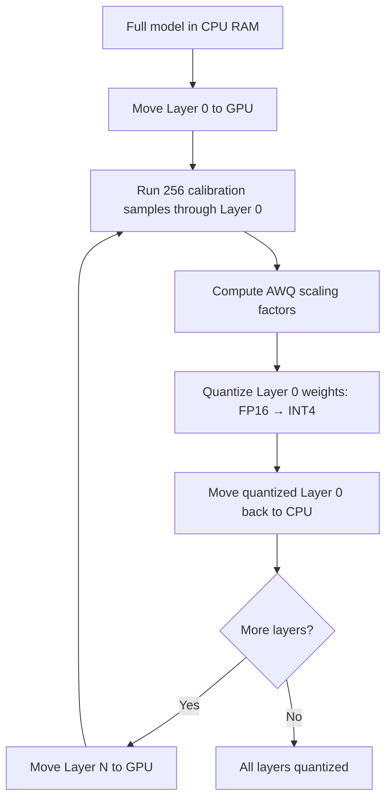

# Quantizing the Model: A Line-by-Line Walkthrough

This walkthrough traces the complete quantization pipeline that produces Zorac's default model — [`dark-side-of-the-code/Mistral-Small-24B-Instruct-2501-AWQ`](https://huggingface.co/dark-side-of-the-code/Mistral-Small-24B-Instruct-2501-AWQ). You'll learn how AWQ quantization works at the code level, why every parameter was chosen, and how a 48GB model becomes a 12GB one that runs at 60+ tok/s on a single RTX 4090.

The full script lives in [`quant-lab/quantize_mistral.py`](https://github.com/chris-colinsky/Zorac/blob/main/quant-lab/quantize_mistral.py) — 72 lines of Python that do the entire job.

!!! info "Related Reading"
For background on what quantization is and how AWQ compares to other formats, see [Quantization Concepts](../concepts/quantization.md). For the decision rationale behind choosing AWQ, see [Why AWQ](../decisions/why-awq.md). This page focuses on the practical process of producing a quantized model yourself.

---

## Why Quantize It Ourselves?

Pre-quantized AWQ models exist on Hugging Face, but quantizing your own gives you:

- **Control over calibration data** — You choose the dataset that determines which weights are protected. A chat-focused calibration dataset produces better results for a chat application than a generic one.
- **Reproducibility** — You know exactly how the model was produced, what software versions were used, and can reproduce it anytime.
- **Format compatibility** — llmcompressor outputs the `compressed-tensors` format that vLLM loads natively, without needing the `autoawq` package at serving time.
- **Flexibility** — You can quantize any model, not just the ones someone else has already published.

---

## The Tool: llmcompressor

The script uses [llmcompressor](https://github.com/vllm-project/llm-compressor) — the vLLM project's official quantization library. This is a deliberate choice over the more widely-known `autoawq` package:

|                         | llmcompressor                                 | autoawq                                     |
| ----------------------- | --------------------------------------------- | ------------------------------------------- |
| **Maintained by**       | vLLM project                                  | Community                                   |
| **Output format**       | `compressed-tensors` (vLLM native)            | AutoAWQ format                              |
| **vLLM compatibility**  | First-class — no extra packages at serve time | Requires `autoawq` installed alongside vLLM |
| **AWQ implementation**  | Full AWQ with activation-aware scaling        | Full AWQ                                    |
| **Sequential pipeline** | Built-in — only needs 1 GPU for quantization  | Requires model to fit in GPU memory         |
| **Recipe system**       | YAML-based, composable                        | Python config objects                       |

The key advantage is the output format. llmcompressor writes `compressed-tensors` files that vLLM understands natively — you just point `vllm serve` at the directory and it works. No extra dependencies at inference time.

---

## Hardware Requirements

Quantization has very different hardware requirements than inference:

| Resource       | Quantization                  | Inference                    |
| -------------- | ----------------------------- | ---------------------------- |
| **GPU**        | 1x any NVIDIA GPU (even 10GB) | 1x 24GB GPU (for 24B model)  |
| **System RAM** | 48GB+ (holds full FP16 model) | 16GB sufficient              |
| **Disk**       | ~60GB (source + output)       | ~14GB (quantized model only) |
| **Time**       | 1-3 hours                     | N/A                          |

The sequential pipeline loads the full FP16 model into CPU RAM, then moves one transformer layer at a time onto the GPU for calibration. This means your system RAM must be large enough to hold the entire unquantized model (~48GB for a 24B model), but your GPU only needs enough VRAM for a single layer (a few hundred MB).

---

## The Script, Step by Step

### Dependencies and Imports

```python
from datasets import load_dataset
from transformers import AutoModelForCausalLM, AutoTokenizer
from llmcompressor import oneshot
```

Three imports, three responsibilities:

- **`datasets`** — Loads the calibration dataset from Hugging Face Hub
- **`transformers`** — Loads the source model and tokenizer
- **`llmcompressor`** — The `oneshot()` function runs the entire calibration-and-quantization pipeline

The project pins `transformers>=4.46.0,<4.50.0` because the Mistral tokenizer introduced a `fix_mistral_regex` parameter in 4.50 that causes compatibility issues with earlier code. The script handles both cases with a try/except.

### Configuration

```python
model_id = "mistralai/Mistral-Small-24B-Instruct-2501"
quant_path = "/home/commander/Sandbox/models/Mistral-Small-24B-Instruct-2501-AWQ"

NUM_CALIBRATION_SAMPLES = 256
MAX_SEQUENCE_LENGTH = 512
```

Every value here is a deliberate choice:

**`model_id`** — The instruction-tuned variant, not the base model. Zorac is a chat application, so the quantized model needs to be one that already understands instruction/chat formatting. Using the base model would require fine-tuning before it could hold a conversation.

**`NUM_CALIBRATION_SAMPLES = 256`** — AWQ needs real data to determine which weights matter most. Too few samples (< 64) gives noisy scaling factors that hurt quality. Too many (> 512) wastes time with diminishing returns — the scaling factor estimates stabilize well before 512 samples. 256 is the standard sweet spot, used across most AWQ quantization guides and tools.

**`MAX_SEQUENCE_LENGTH = 512`** — Each calibration sample is truncated to 512 tokens. This keeps calibration fast (processing 256 samples at 512 tokens each is far quicker than at 4096 tokens), and the scaling factors AWQ computes are not very sensitive to sequence length — the weight importance patterns emerge from even short examples.

### Loading the Tokenizer

```python
try:
    tokenizer = AutoTokenizer.from_pretrained(
        model_id, trust_remote_code=True, fix_mistral_regex=True
    )
except TypeError:
    tokenizer = AutoTokenizer.from_pretrained(
        model_id, trust_remote_code=True
    )
```

The `fix_mistral_regex` parameter was added in `transformers` 4.50 to address a regex compatibility issue in Mistral tokenizers. Since the project pins transformers below 4.50, the script tries the new parameter first and falls back gracefully. This way the script works across versions without modification.

`trust_remote_code=True` is required because Mistral models include custom tokenizer code on the Hub that isn't part of the core transformers library.

### Loading the Model to CPU

```python
model = AutoModelForCausalLM.from_pretrained(
    model_id, torch_dtype="auto", device_map=None
)
```

This is one of the most important lines in the script, and the parameter choices are critical:

**`device_map=None`** — Loads the entire model into CPU RAM, not onto any GPU. This is essential for the sequential pipeline. If you used `device_map="auto"`, the model would be split across available GPUs, and llmcompressor's `SequentialPipeline` — which expects to move layers to GPU one at a time — would encounter layers already on GPU in unknown configurations.

**`torch_dtype="auto"`** — Uses the dtype specified in the model's config (BF16 for Mistral Small). Specifying this explicitly avoids the default FP32, which would double memory usage to ~96GB for no benefit.

!!! warning "Why not `device_map='auto'`?"
It's tempting to load the model across GPUs for speed, but AWQ calibration is inherently sequential — layer N+1 depends on layer N's output. There's no parallel work to be done across GPUs. Loading to CPU and letting the sequential pipeline handle GPU placement is the correct, tested path.

### Preparing the Calibration Dataset

```python
ds = load_dataset(
    "HuggingFaceH4/ultrachat_200k", split=f"train_sft[:{NUM_CALIBRATION_SAMPLES}]"
)
ds = ds.shuffle(seed=42)

def preprocess(example):
    return {
        "text": tokenizer.apply_chat_template(example["messages"], tokenize=False)
    }

ds = ds.map(preprocess)
```

**Dataset choice: `ultrachat_200k`** — This is a large, high-quality dataset of multi-turn chat conversations. The `train_sft` split contains supervised fine-tuning examples with proper message structure (`system`, `user`, `assistant` roles). Using a chat dataset for calibration is important because AWQ determines weight importance based on activation patterns in the calibration data — the data should match the model's intended use case. Since Mistral-Small is an instruction-tuned model and Zorac uses it for chat, calibrating on chat data produces the most representative activation patterns.

**`seed=42`** — Reproducible shuffling. Without this, running the script twice could produce slightly different quantized models because different calibration samples would be selected.

**`apply_chat_template`** — Converts the structured message format (`[{"role": "user", "content": "..."}, ...]`) into the model's expected prompt format with special tokens. This ensures the calibration text matches what the model will actually see during inference, producing more accurate activation patterns.

### The AWQ Recipe

```python
recipe = """
default_stage:
  default_modifiers:
    AWQModifier:
      scheme: W4A16_ASYM
      targets: [Linear]
      ignore: [lm_head]
"""
```

This YAML recipe tells llmcompressor exactly how to quantize. Every field matters:

**`AWQModifier`** — Selects the AWQ algorithm specifically. llmcompressor supports multiple quantization algorithms (GPTQ, SparseGPT, etc.), and the recipe system lets you compose them. Here we use AWQ alone.

**`scheme: W4A16_ASYM`** — Three pieces of information packed into one string:

| Component | Meaning                                                        |
| --------- | -------------------------------------------------------------- |
| **W4**    | Weights quantized to 4-bit integers                            |
| **A16**   | Activations stay at 16-bit (FP16/BF16) during inference        |
| **ASYM**  | Asymmetric quantization — the zero-point is not forced to zero |

Why asymmetric? Neural network weight distributions are often skewed — they don't center neatly on zero. Asymmetric quantization allows the quantization range to shift to cover the actual distribution, wasting fewer of the precious 16 integer values (0-15) on ranges where no weights exist. The trade-off is a slightly more complex dequantization step (one extra addition per group), but the quality improvement is worth it.

**`targets: [Linear]`** — Quantize all linear (fully-connected) layers. In a transformer, this covers the attention projections (Q, K, V, O) and the feed-forward network (up, gate, down projections). These layers contain the vast majority of parameters and are where quantization saves the most memory.

**`ignore: [lm_head]`** — The language model head is the final linear layer that projects hidden states to vocabulary logits. It is kept at full precision because:

1. It directly produces the output probability distribution — small quantization errors here affect every single token prediction
2. It's relatively small compared to the rest of the model (hidden_size x vocab_size = one layer, vs 40+ layers of attention + FFN)
3. The memory savings from quantizing it are minimal, but the quality cost is disproportionately high

**Implicit: `group_size=128`** — Not specified in the recipe because 128 is AWQ's default, and it's the value vLLM's Marlin kernels are optimized for. Each group of 128 consecutive weights shares a single scale and zero-point, balancing accuracy (more groups = better) against metadata overhead (more groups = more scales to store and dequantize).

### Running the Quantization

```python
oneshot(
    model=model,
    dataset=ds,
    recipe=recipe,
    max_seq_length=MAX_SEQUENCE_LENGTH,
    num_calibration_samples=NUM_CALIBRATION_SAMPLES,
)
```

The `oneshot()` function orchestrates the entire calibration and quantization pipeline. Internally, it uses a `SequentialPipeline` that processes the model layer by layer:



For each layer, the pipeline:

1. **Copies the layer** from CPU RAM to GPU VRAM (a few hundred MB — a single transformer layer is small)
2. **Runs all 256 calibration samples** through just that layer, recording the activation magnitudes
3. **Computes per-channel scaling factors** — AWQ identifies which output channels have large activations (meaning those weights are "important") and scales them up before quantization, effectively giving them more of the 4-bit precision budget
4. **Quantizes the weights** — Applies the scaling, rounds to 4-bit integers, and packs them into the `compressed-tensors` format
5. **Moves the quantized layer** back to CPU RAM and proceeds to the next

This sequential approach is why quantization only needs one GPU regardless of model size. The bottleneck is compute (running 256 forward passes per layer across ~40 layers), not memory.

### Saving the Result

```python
os.makedirs(quant_path, exist_ok=True)
model.save_pretrained(quant_path, save_compressed=True)
tokenizer.save_pretrained(quant_path)
```

**`save_compressed=True`** — Writes the quantized weights in `compressed-tensors` format with pack-quantization. This means the 4-bit values are bit-packed into larger integer types for efficient storage and loading. Without this flag, the model would be saved in its in-memory representation, which is larger and slower to load.

The output directory contains everything needed to serve the model:

```text
Mistral-Small-24B-Instruct-2501-AWQ/
├── config.json                        # Model architecture config
├── generation_config.json             # Default generation parameters
├── model-00001-of-00003.safetensors   # Quantized weights (shard 1)
├── model-00002-of-00003.safetensors   # Quantized weights (shard 2)
├── model-00003-of-00003.safetensors   # Quantized weights (shard 3)
├── model.safetensors.index.json       # Shard index
├── recipe.yaml                        # The AWQ recipe (auto-saved by llmcompressor)
├── special_tokens_map.json            # Tokenizer special tokens
├── tokenizer.json                     # Tokenizer vocabulary
└── tokenizer_config.json              # Tokenizer settings
```

The `recipe.yaml` is automatically embedded by llmcompressor, recording the exact quantization parameters used. This is what allows vLLM to detect the quantization scheme automatically at load time — no `--quantization` flag needed.

---

## Why Only One GPU Is Used

If you monitor `nvidia-smi` during quantization on a multi-GPU system, you'll notice only one GPU is active. This is correct and intentional.

AWQ calibration is **inherently sequential**. Each layer's calibration depends on the quantized output of the previous layer — you can't start calibrating layer 31 until layer 30 is fully quantized, because layer 31's input activations flow through all previous layers. Two GPUs can't process two layers simultaneously.

The only theoretical benefit of a second GPU would be eliminating PCIe transfer overhead (CPU ↔ GPU for each layer). But this is not the bottleneck — the forward passes through each layer with 256 samples dominate the runtime. And using `device_map="auto"` to spread the model across GPUs is an unsupported path through llmcompressor's sequential pipeline that risks incorrect quantization or runtime errors.

**When a second GPU does help:** Inference (where the whole model must be in VRAM simultaneously), training (data/tensor parallelism), and GPTQ quantization (which can sometimes process larger blocks).

---

## Serving the Quantized Model

Once quantization is complete, serving is a single command:

```bash
vllm serve dark-side-of-the-code/Mistral-Small-24B-Instruct-2501-AWQ \
    --quantization compressed-tensors \
    --dtype auto \
    --max-model-len 16384 \
    --kv-cache-dtype fp8
```

The `compressed-tensors` flag tells vLLM to use its native quantization format — the same format llmcompressor outputs. vLLM automatically selects the optimal kernel (Marlin on RTX 30/40-series GPUs) based on the model's quantization config, delivering 60-65 tok/s instead of ~6 tok/s with generic kernels. The `--kv-cache-dtype fp8` flag stores the key-value cache in 8-bit floating point, roughly halving KV cache memory and freeing VRAM for longer contexts on 24GB cards. See the [Server Setup Guide](../guides/server-setup.md) for the full production configuration.

---

## Publishing to Hugging Face

After quantizing, the model was uploaded to Hugging Face Hub as [`dark-side-of-the-code/Mistral-Small-24B-Instruct-2501-AWQ`](https://huggingface.co/dark-side-of-the-code/Mistral-Small-24B-Instruct-2501-AWQ):

```bash
# Authenticate (needs a write token)
huggingface-cli login

# Upload the entire output directory
huggingface-cli upload dark-side-of-the-code/Mistral-Small-24B-Instruct-2501-AWQ \
    ~/Sandbox/models/Mistral-Small-24B-Instruct-2501-AWQ \
    --repo-type model
```

This means anyone can use the model without running the quantization themselves — just point vLLM at the Hugging Face model ID and it downloads automatically.

---

## Reproducing the Quantization

To reproduce or modify the quantization:

```bash
cd quant-lab/

# Install dependencies (Python 3.11 required)
uv sync

# Run quantization (downloads ~48GB model on first run)
uv run python quantize_mistral.py
```

Common modifications:

| Goal                   | Change                                    |
| ---------------------- | ----------------------------------------- |
| Different model        | Set `model_id` to any HF model            |
| Different output path  | Set `quant_path`                          |
| Higher quality         | Increase `NUM_CALIBRATION_SAMPLES` to 512 |
| Use second GPU         | Add `device="cuda:1"` to `oneshot()`      |
| Symmetric quantization | Change scheme to `W4A16` (drops `_ASYM`)  |
| 8-bit instead of 4-bit | Change scheme to `W8A16_ASYM`             |

---

## Further Reading

- [AWQ Paper: Activation-aware Weight Quantization](https://arxiv.org/abs/2306.00978) — The original research
- [llmcompressor GitHub](https://github.com/vllm-project/llm-compressor) — The quantization tool
- [compressed-tensors format](https://github.com/neuralmagic/compressed-tensors) — The output format specification
- [Quantization Concepts](../concepts/quantization.md) — How quantization works and format comparison
- [Why AWQ](../decisions/why-awq.md) — The decision rationale for choosing AWQ
- [Server Setup Guide](../guides/server-setup.md) — Configuring vLLM to serve the quantized model
