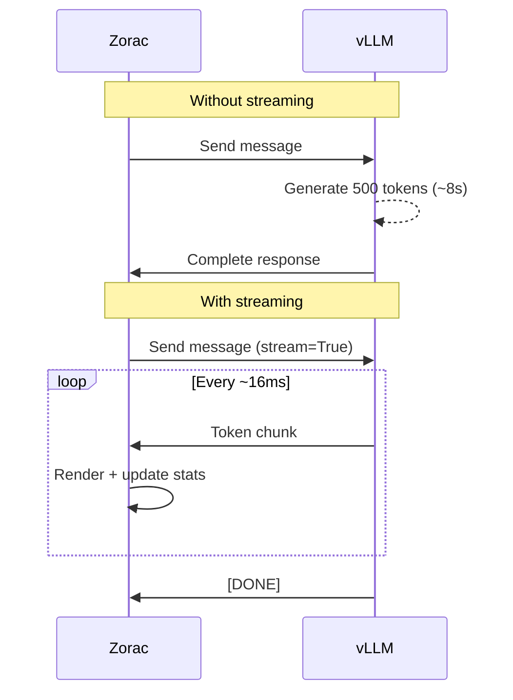

# Streaming Explained

A deep dive into how Zorac streams LLM responses — from the OpenAI streaming API to Textual's Markdown rendering pipeline, with real-time stats calculation.

---

## The Streaming Architecture

### Why Stream Instead of Wait

Without streaming, you'd send a message and wait for the entire response to be generated before seeing anything. For a 500-token response at 60 tok/s, that's an 8-second blank screen.

Streaming changes this: tokens appear as they're generated, giving the user immediate feedback and the ability to read the beginning of the response while the rest is still being produced.



The difference in perceived latency is dramatic. With streaming, the first token appears in 200-500ms (time to first token), and the response builds progressively from there.

### The OpenAI Streaming Protocol

Zorac uses the OpenAI Python client's streaming API:

```python
stream_response = await self.client.chat.completions.create(
    model=self.vllm_model,
    messages=self.messages,
    temperature=self.temperature,
    max_tokens=self.max_output_tokens,
    stream=True,  # ← This enables streaming
)
```

With `stream=True`, the response is an async iterator of `ChatCompletionChunk` objects instead of a single `ChatCompletion`. Each chunk contains a delta — the newly generated token(s):

```python
async for chunk in stream_response:
    content = chunk.choices[0].delta.content  # e.g., "Hello"
```

The client library handles all the HTTP and parsing details. From Zorac's perspective, it's just an async for loop that yields text fragments.

### Server-Sent Events Under the Hood

Under the wire, OpenAI's streaming protocol uses **Server-Sent Events (SSE)** — a simple HTTP-based streaming format. The server sends a series of `data:` lines, each containing a JSON chunk:

```
data: {"choices":[{"delta":{"content":"Hello"}}]}
data: {"choices":[{"delta":{"content":" world"}}]}
data: {"choices":[{"delta":{"content":"!"}}]}
data: [DONE]
```

The connection stays open for the duration of the response. The `[DONE]` sentinel signals that generation is complete.

vLLM implements this protocol natively. The OpenAI Python client parses the SSE stream and yields typed Python objects, so Zorac never handles raw HTTP directly.

---

## The StreamingMixin

### The @work Decorator

The streaming loop can't run on Textual's main thread — it would block the UI event loop, making the application unresponsive to keyboard input (including Ctrl+C to cancel).

Textual's `@work` decorator solves this:

```python
@work(exclusive=True, group="stream")
async def _stream_response(self) -> None:
    ...
```

**File:** `zorac/streaming.py:48`

| Parameter | Purpose |
|-----------|---------|
| `exclusive=True` | Only one instance of this worker can run at a time. Starting a new one automatically cancels any running instance. |
| `group="stream"` | Names the worker group, enabling targeted cancellation via `self.workers.cancel_group(self, "stream")`. |

When `_stream_response()` is called, Textual:

1. Creates a new worker thread
2. Runs the async method inside that thread's event loop
3. Allows the method to safely call `self.query_one()`, `stats_bar.update()`, and other Textual APIs from the worker

### Worker Threads and the Event Loop

Textual workers are cooperative — they can interact with the widget tree through thread-safe methods. The key APIs used during streaming:

```python
# Get references to widgets (thread-safe query)
chat_log = self.query_one("#chat-log", VerticalScroll)
stats_bar = self.query_one("#stats-bar", Static)

# Mount new widgets into the DOM
chat_log.mount(md_widget)

# Update widget content
stats_bar.update(f" {stream_tokens} tokens | {elapsed:.1f}s ")

# Scroll the chat log
chat_log.scroll_end(animate=False)
```

These calls are dispatched to the main thread and executed during Textual's next paint cycle, ensuring thread safety.

### Cancellation with Ctrl+C

When the user presses Ctrl+C during streaming, Textual fires the `action_cancel_stream` action:

```python
def action_cancel_stream(self) -> None:
    if self._streaming:
        self.workers.cancel_group(self, "stream")
        self._streaming = False
        input_widget = self.query_one("#user-input", ChatInput)
        input_widget.disabled = False
        input_widget.focus()
        self._log_system("Response interrupted.", style="yellow")
```

**File:** `zorac/main.py:494-502`

This cancels the worker, which sets `worker.is_cancelled = True`. The streaming loop checks this flag on every chunk:

```python
async for chunk in stream_response:
    if worker.is_cancelled:
        break
    ...
```

The response generated so far is **not saved** to the conversation history when cancelled. This prevents incomplete responses from polluting the context.

---

## Markdown Rendering

### Textual's Markdown.get_stream() API

The core of Zorac's streaming display is `Markdown.get_stream()` — a Textual API that provides a write-based interface for incrementally building Markdown content:

```python
# Create an empty Markdown widget and mount it
md_widget = Markdown("")
chat_log.mount(md_widget)

# Get a streaming handle
stream = Markdown.get_stream(md_widget)

# Write content as it arrives
await stream.write("# Hello\n")
await stream.write("This is **streaming** markdown.\n")
await stream.write("```python\ndef hello():\n    print('world')\n```")

# Finalize the render
await stream.stop()
```

Each `write()` call appends text to the widget's content and triggers a re-render. The widget handles Markdown parsing, syntax highlighting, and layout automatically.

### Incremental Parsing Challenges

Streaming Markdown introduces parsing ambiguities that don't exist with complete documents:

| Content So Far | Is It... |
|----------------|----------|
| `**bold` | Bold text? Or two asterisks followed by "bold"? |
| `` ``` `` | Start of a code block? Or three backticks? |
| `- item\n- ` | A two-item list? Or a one-item list with a pending second item? |

Textual's streaming parser handles these by rendering conservatively and re-parsing when more content arrives. A partial `**` is rendered as plain text until the closing `**` arrives, at which point the entire span is re-rendered as bold.

### How Partial Code Blocks Are Handled

Code blocks are the trickiest streaming element. Consider a response that includes:

```
Here's an example:
```python
def hello():
    print("world")
```
```

During streaming, the parser sees the opening \`\`\`python before the closing \`\`\`. The stream handles this by:

1. Rendering the opening fence as the start of a code block
2. Treating all subsequent content as code (with syntax highlighting)
3. Closing the code block when the closing fence arrives
4. Calling `stream.stop()` at the end to finalize any unclosed elements

This means code blocks render progressively — you see the code being typed out with syntax highlighting in real time, which is one of the most satisfying parts of the streaming experience.

---

## Real-Time Stats

### Token Counting During Streaming

As each chunk arrives, Zorac counts tokens using tiktoken:

```python
stream_tokens = 0

async for chunk in stream_response:
    if chunk.choices[0].delta.content:
        content_chunk = chunk.choices[0].delta.content
        full_content += content_chunk
        stream_tokens += len(self.encoding.encode(content_chunk))
```

**File:** `zorac/streaming.py:113-121`

The encoder (`self.encoding`) is a pre-loaded tiktoken encoder, so there's no overhead from loading the encoding on each chunk. Token counting is fast — microseconds per call — so it doesn't slow down the streaming loop.

!!! info "Per-Chunk vs Final Count"
    The per-chunk token count (`stream_tokens`) may differ slightly from counting the full response at once, because tokenization can depend on context across chunk boundaries. The final stats use a single `encoding.encode(full_content)` call for accuracy.

### Performance Metrics Calculation

During streaming, three metrics are calculated on every chunk:

```python
elapsed = time.time() - start_time
tps = stream_tokens / elapsed if elapsed > 0 else 0
```

After streaming completes, the final metrics are computed:

```python
end_time = time.time()
duration = end_time - start_time
tokens = len(self.encoding.encode(full_content))
tps = tokens / duration if duration > 0 else 0
```

| Metric | During Streaming | After Streaming |
|--------|-----------------|-----------------|
| **Tokens** | Running count per chunk | Final count of full response |
| **Duration** | Elapsed since first token | Total wall-clock time |
| **tok/s** | Running average | Final average |

### Stats Bar Updates

The stats bar (`Static#stats-bar`) is updated on every chunk during streaming:

```python
stats_bar.update(
    f" {stream_tokens} tokens | {elapsed:.1f}s | {tps:.1f} tok/s "
)
```

After streaming, it switches to the full stats format:

```
Stats: 245 tokens in 3.8s (64.5 tok/s) | Total: 4 msgs, ~312/12000 tokens
```

The stats bar persists across interactions — it always shows the most recent response's metrics plus the conversation totals. This provides continuous visibility into both performance and context budget usage without cluttering the chat log.

---

## Non-Streaming Mode

### When to Disable Streaming

Streaming is enabled by default, but you can disable it via:

```bash
/config set STREAM false
```

Reasons to disable streaming:

- **Debugging** — Easier to inspect the complete response in logs
- **Batch processing** — When you don't need real-time output
- **Compatibility** — Some proxy setups don't handle SSE correctly
- **Testing** — The non-streaming path is simpler to test

### The Non-Streaming Code Path

When streaming is disabled, `_stream_response()` takes a simpler path:

```python
if not self.stream_enabled:
    completion_response = await self.client.chat.completions.create(
        model=self.vllm_model,
        messages=self.messages,
        temperature=self.temperature,
        max_tokens=self.max_output_tokens,
        stream=False,  # ← Wait for complete response
    )
    full_content = completion_response.choices[0].message.content or ""
    md_widget = Markdown(full_content)
    chat_log.mount(md_widget)
```

**File:** `zorac/streaming.py:139-153`

The complete response arrives in a single API call. A `Markdown` widget is created with the full content and mounted — no incremental rendering needed.

### Comparing the Two Modes

| Aspect | Streaming | Non-Streaming |
|--------|-----------|---------------|
| **Time to first token** | ~200-500ms | Full generation time (seconds) |
| **User experience** | Progressive, responsive | All-or-nothing |
| **Stats during generation** | Real-time updates | "Thinking..." until done |
| **Cancellation** | Ctrl+C stops immediately | Ctrl+C waits for response |
| **Code complexity** | Higher (chunked parsing) | Lower (single render) |
| **Network protocol** | Server-Sent Events | Standard HTTP response |

For interactive chat (Zorac's primary use case), streaming is strongly preferred. The real-time feedback makes the tool feel responsive even when generating long responses.
