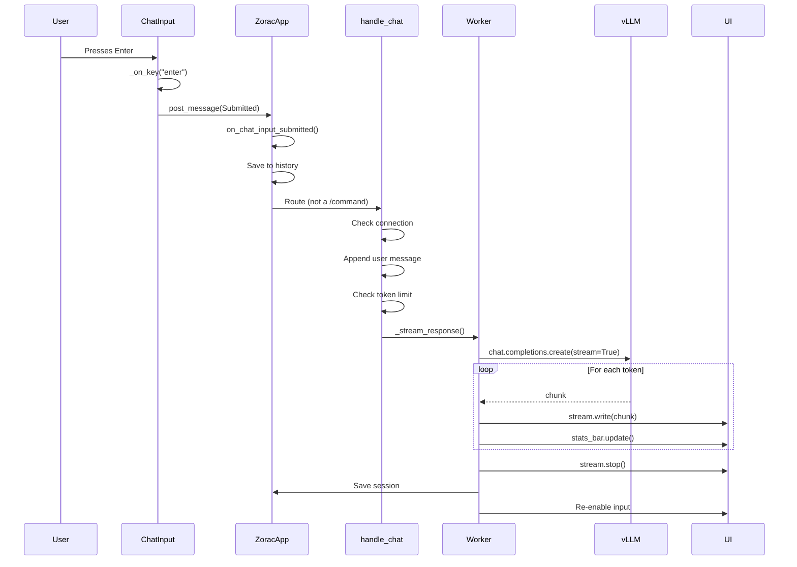

# What Happens When You Press Enter

This walkthrough traces the complete path from the moment you press Enter in Zorac to seeing a fully-rendered, streaming response. Along the way, you'll learn how Textual handles events, how the OpenAI client streams from vLLM, and how Markdown renders in real time.

---

## The Big Picture



Let's trace each step in the source code.

---

## Step 1: The Keypress — `ChatInput._on_key()`

Everything starts in the input widget. `ChatInput` extends Textual's `TextArea` and overrides key handling to make Enter submit (rather than insert a newline).

**File:** `zorac/widgets.py:75-88`

```python
async def _on_key(self, event: events.Key) -> None:
    if event.key == "enter":
        event.stop()
        event.prevent_default()
        text = self.text.strip()
        if text:
            self.post_message(self.Submitted(input=self, value=text))
        return
    elif event.key in ("shift+enter", "ctrl+j"):
        event.stop()
        event.prevent_default()
        self.insert("\n")
        self._auto_resize()
        return
    await super()._on_key(event)
```

When you press Enter:

1. **`event.stop()`** prevents the event from bubbling further up the widget tree
2. **`event.prevent_default()`** prevents TextArea's default behavior (inserting a newline)
3. **`self.text.strip()`** grabs the input text, ignoring empty submissions
4. **`self.post_message(self.Submitted(...))`** sends a custom Textual message

!!! info "Textual's Message System"
    Textual uses a message-passing architecture. Widgets communicate by posting `Message` objects, which bubble up the DOM tree until a handler catches them. This decouples the input widget from the application logic — `ChatInput` doesn't need to know what happens with the text.

The `Submitted` message is a simple dataclass defined on the `ChatInput` class:

```python
@dataclass
class Submitted(Message):
    input: "ChatInput"
    value: str
```

It carries the input widget reference (for clearing it later) and the text value.

---

## Step 2: Message Routing — `on_chat_input_submitted()`

Textual automatically routes messages to handler methods named `on_<widget>_<message>`. Since our message is `ChatInput.Submitted`, the handler is `on_chat_input_submitted`.

**File:** `zorac/main.py:409-442`

```python
async def on_chat_input_submitted(self, event: ChatInput.Submitted) -> None:
    user_input = event.value.strip()
    event.input.clear()
    event.input._auto_resize()
    self._history_index = -1
    self._history_temp = ""

    if not user_input:
        return

    # Save to history, deduplicating consecutive identical entries
    if not self._history or self._history[-1] != user_input:
        self._history.append(user_input)
        self._save_history()

    # Route input: commands start with "/", everything else is chat
    if user_input.startswith("/"):
        parts = user_input.split()
        cmd = parts[0].lower()
        if cmd in self.command_handlers:
            await self.command_handlers[cmd](parts)
        else:
            self._log_system(
                f"Unknown command: {cmd}. Type /help for available commands.",
                style="red",
            )
    else:
        await self.handle_chat(user_input)
```

This method does several things:

1. **Clears the input** immediately (so the user sees a clean input bar)
2. **Resets history navigation** (in case the user was browsing history with Up/Down arrows)
3. **Saves to command history** for future Up-arrow recall
4. **Routes the input**: if it starts with `/`, look it up in the command dispatch table; otherwise, send it to `handle_chat()`

The command dispatch table (`self.command_handlers`) is a dict mapping command strings to async methods, defined in `__init__`:

```python
self.command_handlers = {
    "/quit": self.cmd_quit,
    "/exit": self.cmd_quit,
    "/help": self.cmd_help,
    "/clear": self.cmd_clear,
    # ... more commands
}
```

For regular chat messages (our case), we proceed to `handle_chat()`.

---

## Step 3: Chat Processing — `handle_chat()`

This is the orchestration layer that prepares the conversation for the LLM.

**File:** `zorac/main.py:448-488`

```python
async def handle_chat(self, user_input: str) -> None:
    assert self.client is not None

    # Keep system message date current for long-running sessions
    self._refresh_system_date()

    # Lazy connection check: if we're offline, try to reconnect
    if not self.is_connected:
        self.is_connected = await self._check_connection()
        if not self.is_connected:
            self._log_system(
                "Still offline. Use /reconnect to retry or check your server.",
                style="bold yellow",
            )
            return

    self._log_user(user_input)
    self.messages.append({"role": "user", "content": user_input})

    # Check if we've exceeded the token limit and need to summarize
    current_tokens = count_tokens(self.messages)
    if current_tokens > MAX_INPUT_TOKENS:
        await self._summarize_messages()

    # Disable input during streaming to prevent overlapping requests
    input_widget = self.query_one("#user-input", ChatInput)
    input_widget.disabled = True
    self._streaming = True

    self._stream_response()
```

Step by step:

1. **Date refresh** — For sessions that span midnight, update the system message's date
2. **Connection check** — If offline, try to reconnect before sending the message
3. **Display the user's message** in the chat log via `_log_user()`
4. **Append to conversation history** — The `messages` list follows the OpenAI message format (`role` + `content`)
5. **Token budget check** — `count_tokens()` uses tiktoken to count the total tokens in the conversation. If it exceeds `MAX_INPUT_TOKENS` (default: 12,000), older messages are summarized to free up space
6. **Disable input** — Prevents the user from sending another message while streaming
7. **Launch the streaming worker** — `_stream_response()` runs in a background thread

!!! note "Why disable input?"
    vLLM processes one request at a time per connection. Sending a second message while the first is streaming would either queue it (confusing) or cause an error. Disabling the input widget provides clear visual feedback that the system is busy.

---

## Step 4: Streaming — `_stream_response()`

This is where the magic happens. The `@work` decorator makes this method run in a Textual worker thread, so the UI stays responsive during streaming.

**File:** `zorac/streaming.py:48-191`

```python
@work(exclusive=True, group="stream")
async def _stream_response(self) -> None:
    assert self.client is not None
    from textual.worker import get_current_worker

    worker = get_current_worker()
    chat_log = self.query_one("#chat-log", VerticalScroll)
    stats_bar = self.query_one("#stats-bar", Static)
    input_widget = self.query_one("#user-input", ChatInput)

    # Add assistant label
    label = Static("\n[bold purple]Assistant:[/bold purple]")
    chat_log.mount(label)
    label.scroll_visible()

    stats_bar.update(" Thinking... ")
```

The `@work(exclusive=True, group="stream")` decorator is critical:

- **`exclusive=True`** — Only one instance of this worker can run at a time
- **`group="stream"`** — Allows `action_cancel_stream()` to cancel it by group name when the user presses Ctrl+C

### The OpenAI Streaming Call

```python
stream_response = await self.client.chat.completions.create(
    model=self.vllm_model,
    messages=self.messages,
    temperature=self.temperature,
    max_tokens=self.max_output_tokens,
    stream=True,
)
```

This sends the full conversation history to vLLM via the OpenAI-compatible API. With `stream=True`, the response comes back as an async iterator of chunks rather than a single complete response.

### Live Markdown Rendering

```python
md_widget = Markdown("")
chat_log.mount(md_widget)
md_widget.scroll_visible()

stream = Markdown.get_stream(md_widget)
stream_tokens = 0

async for chunk in stream_response:
    if worker.is_cancelled:
        break

    if chunk.choices[0].delta.content:
        content_chunk = chunk.choices[0].delta.content
        full_content += content_chunk
        stream_tokens += len(self.encoding.encode(content_chunk))
        elapsed = time.time() - start_time
        tps = stream_tokens / elapsed if elapsed > 0 else 0

        await stream.write(content_chunk)
        chat_log.scroll_end(animate=False)

        stats_bar.update(
            f" {stream_tokens} tokens | {elapsed:.1f}s | {tps:.1f} tok/s "
        )

await stream.stop()
```

This is the token-by-token streaming loop:

1. **Create a Markdown widget** and mount it in the chat log
2. **Get a streaming handle** via `Markdown.get_stream()` — this is Textual's API for incrementally building Markdown content
3. **For each chunk** from vLLM:
    - Check if the user cancelled (Ctrl+C)
    - Extract the text delta from the OpenAI chunk format
    - Count tokens using tiktoken for performance stats
    - **Write to the Markdown stream** — the widget re-renders automatically as content arrives, handling code blocks, lists, headings, etc.
    - Keep the chat log scrolled to the bottom
    - Update the stats bar with real-time metrics
4. **Finalize the stream** with `stream.stop()` so the Markdown widget completes its final render

!!! info "Why Textual's Markdown.get_stream()?"
    Earlier versions of Zorac used Rich's `Live` display, which had flickering issues with complex Markdown. Textual's streaming API was purpose-built for this use case — it handles incremental Markdown parsing correctly, including partial code blocks and nested formatting.

---

## Step 5: Cleanup and Stats

After streaming completes (or is cancelled), the worker finalizes:

```python
# Calculate performance metrics
end_time = time.time()
duration = end_time - start_time
tokens = len(self.encoding.encode(full_content)) if full_content else 0
tps = tokens / duration if duration > 0 else 0

# Save the assistant's response
if full_content and not worker.is_cancelled:
    self.messages.append({"role": "assistant", "content": full_content})
    save_session(self.messages)

# Update stats bar
current_tokens = count_tokens(self.messages)
self.stats = {
    "tokens": tokens,
    "duration": duration,
    "tps": tps,
    "total_msgs": len(self.messages),
    "current_tokens": current_tokens,
}
self._update_stats_bar()

# Re-enable input
self._streaming = False
input_widget.disabled = False
input_widget.focus()
```

This step:

1. **Calculates final performance metrics** using tiktoken for accurate token counts
2. **Appends the assistant's response** to the conversation history (unless cancelled)
3. **Auto-saves the session** to `~/.zorac/session.json` — so no conversation is lost even if the terminal crashes
4. **Updates the stats bar** with the final metrics: token count, duration, tokens/second, and total conversation size
5. **Re-enables the input widget** and gives it focus so the user can type their next message

The stats bar now shows something like:

```
Stats: 245 tokens in 3.8s (64.5 tok/s) | Total: 4 msgs, ~312/12000 tokens
```

---

## Summary: The Complete Flow

| Step | File | Method | What Happens |
|------|------|--------|-------------|
| 1 | `widgets.py` | `_on_key()` | Enter keypress caught, `Submitted` message posted |
| 2 | `main.py` | `on_chat_input_submitted()` | Input cleared, history saved, routed to chat |
| 3 | `main.py` | `handle_chat()` | Connection checked, message appended, tokens counted |
| 4 | `streaming.py` | `_stream_response()` | OpenAI API called, Markdown streamed, stats updated |
| 5 | `streaming.py` | (cleanup) | Session saved, input re-enabled, stats finalized |

The entire flow — from keypress to first visible token — typically takes 200-500ms on a local network, with tokens then streaming at 60-65 tok/s on an RTX 4090. The architecture keeps the UI responsive throughout by running the streaming work in a background thread.
